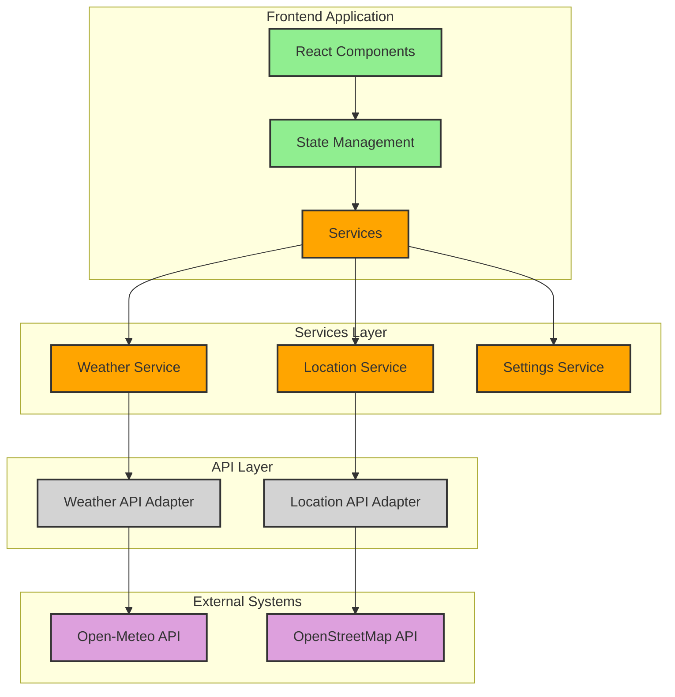
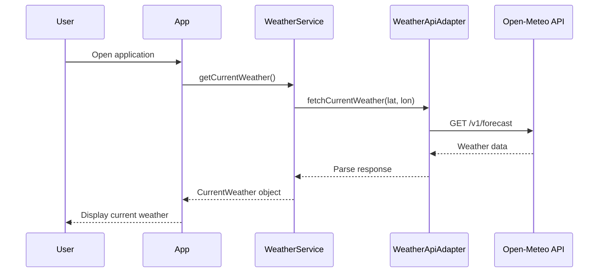

### Detailed Use Cases

#### UC-001: View Current Weather

- **Actor**: User
- **Precondition**: User has internet connection
- **Trigger**: User opens the application or refreshes current weather
- **Main Success Scenario**:
  1. System determines user's location or uses saved location
  2. System fetches current weather data from API
  3. System displays current weather information including temperature, conditions, and other details
- **Alternative Flows**:
  - **1a**: If location cannot be determined, prompt user to search for a location
- **Exception Flows**:
  - **E1**: If API call fails, display error message and retry option
- **Postcondition**: User sees current weather information

#### UC-002: View 3-Day Forecast

- **Actor**: User
- **Precondition**: User has internet connection
- **Trigger**: User navigates to 3-day forecast view
- **Main Success Scenario**:
  1. System fetches 3-day forecast data from API
  2. System displays weather forecast for the next 3 days
  3. System shows high/low temperatures, conditions, and probability of precipitation
- **Exception Flows**:
  - **E1**: If API call fails, display error message and retry option
- **Postcondition**: User sees 3-day forecast information

#### UC-003: View 7-Day Forecast

- **Actor**: User
- **Precondition**: User has internet connection
- **Trigger**: User navigates to 7-day forecast view
- **Main Success Scenario**:
  1. System fetches 7-day forecast data from API
  2. System displays weather forecast for the next 7 days
  3. System shows high/low temperatures, conditions, and probability of precipitation
- **Exception Flows**:
  - **E1**: If API call fails, display error message and retry option
- **Postcondition**: User sees 7-day forecast information

#### UC-004: Search Location

- **Actor**: User
- **Precondition**: User has internet connection
- **Trigger**: User initiates location search
- **Main Success Scenario**:
  1. System displays search input field
  2. User enters location name or coordinates
  3. System fetches matching locations from API
  4. System displays matching locations
  5. User selects desired location
  6. System updates weather data for selected location
- **Alternative Flows**:
  - **3a**: If no matches found, display appropriate message
- **Exception Flows**:
  - **E1**: If API call fails, display error message
- **Postcondition**: Weather data for selected location is displayed

#### UC-005: Toggle Temperature Units

- **Actor**: User
- **Trigger**: User toggles temperature unit setting
- **Main Success Scenario**:
  1. User selects preferred temperature unit (Celsius/Fahrenheit)
  2. System updates display of all temperature values
  3. System stores preference for future sessions
- **Postcondition**: All temperatures are displayed in user's preferred unit

## System Components Diagram



## Class Diagrams & ERDs

```mermaid
classDiagram
    class WeatherService {
        +getCurrentWeather(location: Location): Promise<CurrentWeather>
        +get3DayForecast(location: Location): Promise<DayForecast[]>
        +get7DayForecast(location: Location): Promise<DayForecast[]>
        +getHourlyForecast(location: Location): Promise<HourForecast[]>
    }

    class LocationService {
        +getCurrentLocation(): Promise<Location>
        +searchLocations(query: string): Promise<Location[]>
        +saveLocation(location: Location): void
        +getSavedLocations(): Location[]
    }

    class SettingsService {
        +getTemperatureUnit(): TemperatureUnit
        +setTemperatureUnit(unit: TemperatureUnit): void
    }

    class WeatherApiAdapter {
        -apiClient: AxiosInstance
        +fetchCurrentWeather(lat: number, lon: number): Promise<any>
        +fetchForecast(lat: number, lon: number, days: number): Promise<any>
        +fetchHourlyForecast(lat: number, lon: number): Promise<any>
    }

    class LocationApiAdapter {
        -apiClient: AxiosInstance
        +searchLocationsByName(query: string): Promise<any>
        +getLocationByCoordinates(lat: number, lon: number): Promise<any>
    }

    class CurrentWeather {
        +temperature: number
        +feelsLike: number
        +condition: string
        +icon: string
        +humidity: number
        +windSpeed: number
        +windDirection: string
        +pressure: number
        +visibility: number
        +uvIndex: number
        +lastUpdated: Date
    }

    class DayForecast {
        +date: Date
        +highTemp: number
        +lowTemp: number
        +condition: string
        +icon: string
        +precipProbability: number
        +sunrise: Date
        +sunset: Date
    }

    class HourForecast {
        +time: Date
        +temperature: number
        +condition: string
        +icon: string
        +precipProbability: number
    }

    class Location {
        +name: string
        +country: string
        +state?: string
        +latitude: number
        +longitude: number
    }

    enum TemperatureUnit {
        CELSIUS
        FAHRENHEIT
    }

    WeatherService --> WeatherApiAdapter
    LocationService --> LocationApiAdapter
    WeatherService ..> CurrentWeather
    WeatherService ..> DayForecast
    WeatherService ..> HourForecast
    WeatherService ..> Location
    LocationService ..> Location
    SettingsService ..> TemperatureUnit
```

## Sequence Diagrams

### Fetching Current Weather



## Tech Stack

### Frontend

- **Framework**: React 18 with TypeScript
- **Build Tool**: Vite
- **State Management**: React Context API with hooks
- **Styling**: Tailwind CSS for utility-first styling
- **HTTP Client**: Axios for API requests
- **Testing**: Jest and React Testing Library
- **Weather Icons**: React-Icons or custom SVG components

### APIs

- **Weather Data**: Open-Meteo API (open source, no API key required)
- **Geocoding**: OpenStreetMap Nominatim API (open source)

### Storage

- **Local Storage**: For saving user preferences and recently searched locations

## Module & Layer Breakdown

### Frontend Application Structure

```
src/
├── assets/            # Static assets (icons, images, etc.)
├── components/        # Reusable UI components
│   ├── common/        # Shared UI elements (Button, Card, etc.)
│   ├── layout/        # Layout components (Header, Footer, etc.)
│   └── weather/       # Weather-specific components
├── context/           # React Context providers
├── hooks/             # Custom React hooks
├── pages/             # Page components
├── services/          # Service layer for API communication
├── types/             # TypeScript type definitions
├── utils/             # Utility functions
└── App.tsx            # Main application component
```

## Cross-cutting Concerns

### Error Handling

- Global error boundary for React components
- Error states for API requests with user-friendly messages
- Retry mechanisms for failed API calls

### Caching Strategy

- Cache weather data with appropriate TTL values
- Cache location search results locally
- Store user preferences in local storage

### Performance Optimization

- Lazy loading of components
- Memoization of expensive calculations
- Debouncing for search inputs
- Code splitting for route-based components

## Repository Structure

```
/
├── .docs/             # Documentation
│   └── designs/       # Design documents
├── .github/           # GitHub configuration
│   └── workflows/     # GitHub Actions workflows
├── public/            # Public static assets
├── src/               # Source code (as defined above)
├── tests/             # Test files
├── .eslintrc.js       # ESLint configuration
├── .prettierrc        # Prettier configuration
├── index.html         # Entry HTML file
├── package.json       # NPM package configuration
├── tailwind.config.js # Tailwind CSS configuration
├── tsconfig.json      # TypeScript configuration
└── vite.config.ts     # Vite configuration
```

## Security Architecture

- Sanitize user inputs to prevent XSS attacks
- Implement proper CORS configuration
- Use HTTPS for all API requests

## Risk & Mitigation Table

| Risk                          | Probability | Impact | Mitigation                                                       |
| ----------------------------- | ----------- | ------ | ---------------------------------------------------------------- |
| API rate limiting             | Medium      | High   | Implement caching, display last known data if API is unavailable |
| Inaccurate location detection | Medium      | Medium | Allow manual location entry, save frequent locations             |
| Poor performance on mobile    | Low         | High   | Optimize for mobile-first, careful use of animations             |
| Browser compatibility issues  | Medium      | Medium | Use modern but well-supported features, polyfills where needed   |

## Milestones

### Milestone 1: Design & Planning (0-15%)

- Complete frontend design specifications
- Finalize API integration approach
- Define data models and component structure

### Milestone 2: Project Setup & Configuration (15-25%)

- Initialize React project with Vite, TypeScript, and Tailwind CSS
- Set up project structure and repository
- Configure linting and formatting tools

### Milestone 3: API Integration (25-40%)

- Implement Weather API service
- Implement Location API service
- Create data models and type definitions

### Milestone 4: Core Components Development (40-60%)

- Develop reusable UI components
- Implement weather display components
- Create location search functionality

### Milestone 5: Feature Implementation (60-80%)

- Implement current weather view
- Implement 3-day forecast view
- Implement 7-day forecast view
- Add unit toggle functionality

### Milestone 6: Testing & Refinement (80-95%)

- Write unit and integration tests
- Perform responsive testing across devices
- Optimize performance and accessibility

### Milestone 7: Final Polish & Deployment (95-100%)

- Final UI refinements
- Deployment preparation
- Documentation completion

## IMPLEMENTATION PLAN

The implementation of the weather application will follow the milestones outlined above. We'll use React with TypeScript and Vite to create a modern, responsive application that follows the design guidelines provided in the theme examples. The Open-Meteo API will be used as the weather data source, ensuring we comply with the requirement to use open-source data with no licensing requirements.

Key implementation aspects:

1. Focus on clean, maintainable code structure
2. Responsive design that works well on all device sizes
3. Beautiful UI with weather-appropriate visualizations
4. Support for current weather, 3-day and 7-day forecasts
