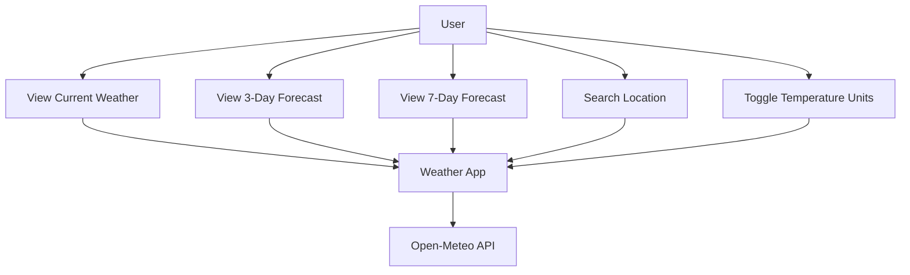

# Weather Application Implementation Plan

## Executive Summary

This plan outlines the development of a modern weather application built with React, TypeScript, and Vite. The application will provide users with current weather conditions, 3-day forecasts, and 7-day forecasts using open-source weather data from the Open-Meteo API. The UI design will follow modern design principles with a clean, intuitive interface that emphasizes visual data presentation, drawing inspiration from the theme provided in the UI examples folder.

## Navigation Block

### Session State Tracking

- Progress tracking: `.ai/session-state.md`
- Implementation status: `src/` directory
- Design documents: `.docs/designs/*.md`

### Context Recovery Commands

1. `read_file .ai/plan.md` - This plan
2. `read_file .ai/session-state.md` - Current session state
3. `list_dir src/` - Implementation progress
4. `read_file .docs/designs/5-frontend.md` - UI design specification

### Milestone Quick Reference

| Milestone | Description                   | Progress |
| --------- | ----------------------------- | -------- |
| 1         | Design & Planning             | 0-15%    |
| 2         | Project Setup & Configuration | 15-25%   |
| 3         | API Integration               | 25-40%   |
| 4         | Core Components Development   | 40-60%   |
| 5         | Feature Implementation        | 60-80%   |
| 6         | Testing & Refinement          | 80-95%   |
| 7         | Final Polish & Deployment     | 95-100%  |

## System Use Cases

### Functional Requirements

- **FR-001**: Display current weather conditions for a location
- **FR-002**: Show 3-day weather forecast
- **FR-003**: Show 7-day weather forecast
- **FR-004**: Allow users to search for locations
- **FR-005**: Display detailed weather information (temperature, humidity, wind, etc.)
- **FR-006**: Support responsive design for all device sizes
- **FR-007**: Allow users to toggle between Celsius and Fahrenheit

### Non-Functional Requirements

- **NFR-001**: Modern, visually appealing UI based on the theme example
- **NFR-002**: Responsive performance across devices
- **NFR-003**: Fast loading times and efficient API usage
- **NFR-004**: Accessibility compliance

### Use Case Diagrams

#### High-Level System Overview

