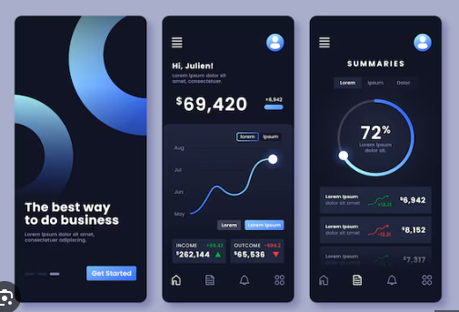

# Modern Weather App

A beautiful, modern weather application built with React, TypeScript, and Vite that provides current weather conditions, 3-day and 7-day forecasts.



## Features

- ☀️ Current weather conditions with detailed information
- 🌡️ 3-day and 7-day weather forecasts
- 🌍 Location search functionality
- 🔄 Toggle between Celsius and Fahrenheit
- 📱 Fully responsive design for all device sizes
- 🌙 Modern dark theme with glassmorphic UI elements

## Tech Stack

- **Frontend Framework**: React 18 with TypeScript
- **Build Tool**: Vite
- **Styling**: Tailwind CSS
- **State Management**: React Context API
- **HTTP Client**: Axios
- **Weather Data**: Open-Meteo API (open source, no API key required)

## Getting Started

### Prerequisites

- Node.js 18+
- npm or yarn

### Installation

1. Clone the repository:

   ```bash
   git clone https://github.com/yourusername/weather-app.git
   cd weather-app
   ```

2. Install dependencies:

   ```bash
   npm install
   ```

3. Start the development server:

   ```bash
   npm run dev
   ```

4. Open your browser and navigate to `http://localhost:3000`

## Building for Production

To create a production build:

```bash
npm run build
```

The built files will be in the `dist` directory.

## Project Structure

```
src/
├── assets/            # Static assets (icons, images, etc.)
├── components/        # Reusable UI components
│   ├── common/        # Shared UI elements (Button, Card, etc.)
│   ├── layout/        # Layout components (Header, Footer, etc.)
│   └── weather/       # Weather-specific components
├── context/           # React Context providers
├── hooks/             # Custom React hooks
├── pages/             # Page components
├── services/          # Service layer for API communication
├── types/             # TypeScript type definitions
├── utils/             # Utility functions
└── App.tsx            # Main application component
```

## API Integration

This application uses the [Open-Meteo API](https://open-meteo.com/) for weather data, which is completely free and open source with no API key required.

## License

MIT
| 📱 **Mobile Backend** | REST APIs, push notifications, offline sync |
| 📊 **Analytics Dashboard** | Data visualization, reporting, user management |
| 🎮 **Gaming Platform** | User profiles, leaderboards, real-time gameplay |

## 🎨 Pro Tips for Best Results

### Visual Inspiration is Key

- **Screenshot apps you love**: The AI uses these to create beautiful, modern interfaces
- **Mention specific design styles**: "Clean like Linear" or "Rich like Stripe"
- **Share color preferences**: Brand colors or general palette preferences
- **Reference successful apps**: "Social features like Discord" or "Dashboard like Vercel"

### Project Description Tips

- **Be specific about features**: "User authentication, real-time chat, file uploads"
- **Mention scale**: "Support 1000+ concurrent users" or "Personal project"
- **Include integrations**: "Stripe payments, SendGrid emails, AWS storage"
- **Specify platforms**: "Web app with mobile API" or "Desktop and mobile"

## 📚 Real Examples

### E-commerce Platform

```
Input: "Build an online store with user accounts, product catalog,
shopping cart, Stripe payments, and admin dashboard"

✅ Complete React storefront with product browsing and cart
✅ Secure payment processing with Stripe integration
✅ Admin dashboard for inventory and order management
✅ User authentication and account management
✅ Docker containers and CI/CD pipeline
✅ Production deployment with monitoring
```

### Team Chat Application

```
Input: "Create a Slack-like chat app with multiple channels,
direct messages, file sharing, and user presence"

✅ Real-time messaging with WebSocket support
✅ Channel management and direct messaging
✅ File upload and sharing capabilities
✅ User presence and online status
✅ Mobile-responsive design
✅ Complete backend API with authentication
```

### SaaS Analytics Dashboard

```
Input: "Build a data analytics platform with user accounts,
custom dashboards, data visualization, and team collaboration"

✅ Interactive dashboards with charts and metrics
✅ Custom widget builder for data visualization
✅ Multi-tenant architecture with team workspaces
✅ Data pipeline integration and real-time updates
✅ Role-based access control and user management
✅ Scalable architecture with microservices
```

## 🤝 Community & Support

- **🐛 Issues & Questions**: [GitHub Issues](https://github.com/frostaura/fa.templates.vibe-coding/issues)
- **💡 Feature Requests**: [GitHub Discussions](https://github.com/frostaura/fa.templates.vibe-coding/discussions)
- **📖 Framework Documentation**: [Architecture Guide](.docs/design.md) | [Repository Structure](.docs/repo-structure.md)
- **🐳 Docker Support**: [Docker Setup Guide](.docs/docker-support.md)

## 🙏 Credits & Inspiration

**Special thanks to [Conway Osler](https://www.linkedin.com/in/conway-osler)** for the project inspiration that started this framework.

Built on the shoulders of giants:

- **iDesign Architecture** by Juval Löwy
- **Clean Architecture** by Robert C. Martin
- **Domain-Driven Design** by Eric Evans

<h1 align="center">
  <b>GAIA</b>
</h1>
<p align="center"><i>"In Greek mythology, Gaia is the personification of Earth and the ancestral mother of all life."</i></p>
